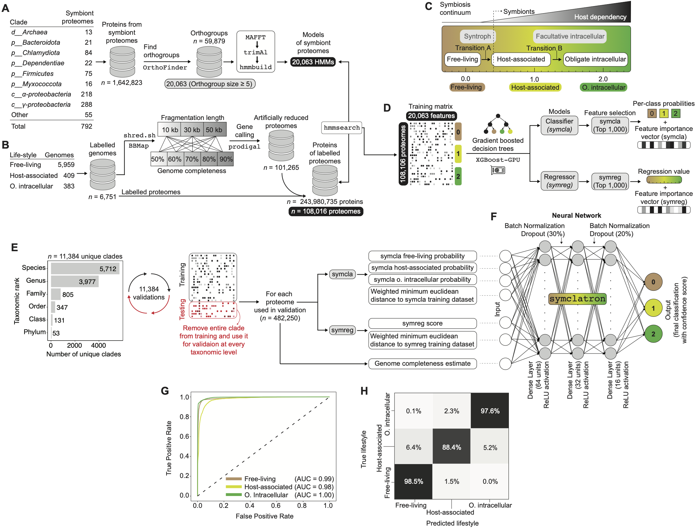

# symclatron: symbiont classifier



`symclatron` classifies microbial genomes into three lifestyle categories:

- `Free-living`
- `Symbiont;Host-associated`
- `Symbiont;Obligate-intracellular`

It accepts protein FASTA directly, or nucleotide FASTA with automatic conversion to proteins before classification.

## What symclatron implements

For each genome, `symclatron` currently performs the following workflow:

1. Validates the input FASTA file(s) and checks that genome identifiers derived from filenames are unique.
2. Detects whether each input file contains proteins, nucleotide genes/CDS, or nucleotide contigs/assemblies.
3. Converts nucleotide input to proteins.
   - Gene/CDS FASTA (`.ffn`, `.fnn`) is translated in frame.
   - Contig/assembly FASTA (`.fa`, `.fas`, `.fasta`, `.fna`) is gene-called and translated with `pyrodigal`.
4. Runs HMM searches against the `symclatron` feature set and the `UNI56` marker set.
5. Builds feature matrices for the `symcla`, `symreg`, and `hostcla` XGBoost submodels.
6. Computes additional distance-based features relative to the training data.
7. Applies the final neural-network model to produce the reported class and confidence score.
8. Optionally relabels low-confidence predictions as `Unknown` when `--confidence-threshold` is provided.
9. Writes final tables, summaries, logs, and optional intermediate files.

The final reported class is produced by the neural-network stage. The `hostcla` model is still run and its intermediate bitscore table is retained in the output directory.

## Installation

The project metadata currently targets Python `3.12` on POSIX/Linux systems. The recommended install path is `pixi`; `mamba`/`conda` also works.

### Option 1: `pixi` (recommended)

Install `pixi`:

```sh
curl -fsSL https://pixi.sh/install.sh | sh
```

Then install `symclatron` and download the data bundle:

```sh
pixi global install -c conda-forge -c bioconda -c https://repo.prefix.dev/astrogenomics symclatron
symclatron setup
```

Run the bundled self-test:

```sh
symclatron test
```

### Option 2: `mamba` or `conda`

```sh
mamba create -n symclatron -c conda-forge -c bioconda -c https://repo.prefix.dev/astrogenomics symclatron
mamba run -n symclatron symclatron setup
mamba run -n symclatron symclatron test
```

`pixi global install` and the conda-based workflow install both CLI names:

- `symclatron`
- `symcla`

For example, `symcla classify ...` is equivalent to `symclatron classify ...`.

## First-time setup

Before classification, download the packaged database and model bundle once:

```sh
symclatron setup
```

Useful setup options:

- `--force`, `-f`: remove any existing bundled data and download again
- `--data-url`: override the default GitHub Release URL
- `--data-sha256`: verify the downloaded archive against a SHA256 digest
- `--quiet`, `-q`: suppress routine progress messages

By default, `setup` downloads the bundle from the GitHub Release tag `db-latest`.

## Accepted inputs

`--genome-dir` can point either to a directory containing one genome per file, or to a single FASTA file.

### Supported FASTA input types

| Input type | Typical suffixes | What symclatron does |
| --- | --- | --- |
| Protein FASTA | `.faa`, `.faa.gz`, `.aa`, `.aa.fasta`, `.pep`, `.pep.fasta`, `.protein.faa` | Uses proteins directly |
| Nucleotide genes/CDS FASTA | `.ffn`, `.ffn.gz`, `.fnn`, `.fnn.gz` | Translates sequences in frame |
| Nucleotide contig/assembly FASTA | `.fa`, `.fa.gz`, `.fas`, `.fas.gz`, `.fasta`, `.fasta.gz`, `.fna`, `.fna.gz` | Predicts genes and proteins with `pyrodigal` |

Notes:

- Gzipped FASTA files are supported.
- If file extensions are ambiguous, use `--input-kind proteins`, `--input-kind genes`, or `--input-kind contigs`.
- Use `--input-ext` to restrict which files are picked up from a directory.
- Genome identifiers in the output come from input filenames, so filenames should be unique within a run.

## Quick start

### Classify protein FASTA

```sh
symclatron classify --genome-dir /path/to/proteins --output-dir results
```

### Classify contig FASTA and predict proteins automatically

```sh
symclatron classify --genome-dir /path/to/contigs --output-dir results
```

### Force contig mode and only include `.fna` files

```sh
symclatron classify \
  --genome-dir /path/to/inputs \
  --input-kind contigs \
  --input-ext .fna \
  --output-dir results
```

### Apply a conservative confidence threshold

```sh
symclatron classify \
  --genome-dir /path/to/genomes \
  --confidence-threshold 0.725 \
  --output-dir results
```

## CLI reference

### `symclatron classify`

```sh
symclatron classify [OPTIONS]
```

Options:

- `--genome-dir`, `-i`: input directory or single FASTA file
- `--input-kind`: `auto`, `proteins`, `genes`, or `contigs`
- `--input-ext`: limit directory scanning to specific extensions; repeat the flag or pass comma-separated values
- `--output-dir`, `-o`: results directory; default is `output_Symclatron_<DATETIME>`
- `--keep-tmp`: keep intermediate files instead of removing `tmp/`
- `--threads`, `-t`: number of HMMER threads, from `1` to `32`
- `--confidence-threshold`: value in `(0, 1]`; adds conservative thresholded labels to the results table
- `--quiet`, `-q`: suppress routine console progress output
- `--verbose`: increase log detail

Examples:

```sh
symclatron classify --genome-dir genomes --output-dir results
symclatron classify --genome-dir genomes --threads 8 --keep-tmp --output-dir results
symclatron classify --genome-dir genomes --quiet --output-dir results
symclatron classify --genome-dir genomes --verbose --output-dir results
```

### `symclatron test`

```sh
symclatron test [OPTIONS]
```

This runs the bundled example data installed by `symclatron setup`.

Options:

- `--keep-tmp`: keep intermediate files for the test run
- `--mode`: `proteins`, `contigs`, or `both` (default)
- `--output-dir`, `-o`: test output root; default is `output_test_Symclatron_<DATETIME>`

When `--mode both` is used, results are written under:

- `<output-dir>/faa`
- `<output-dir>/fna`

### `symclatron setup`

```sh
symclatron setup [OPTIONS]
```

Options:

- `--force`, `-f`: redownload the data bundle even if it already exists
- `--quiet`, `-q`: suppress routine setup messages
- `--data-url`: override the default bundle URL
- `--data-sha256`: expected SHA256 digest for the bundle

### Help and version

```sh
symclatron --help
symclatron classify --help
symclatron setup --help
symclatron test --help
symclatron --version
```

## Output files

The main output directory contains the final results plus logs and selected intermediate files.

### Final result table: `symclatron_results.tsv`

Columns:

- `taxon_oid`: genome identifier derived from the input filename
- `completeness_UNI56`: estimated completeness based on the `UNI56` marker set
- `classification`: final predicted lifestyle class
- `confidence`: confidence score for the reported class
- `passes_confidence_threshold`: optional boolean column added when `--confidence-threshold` is used
- `classification_thresholded`: optional conservative label added when `--confidence-threshold` is used; predictions below threshold are reported as `Unknown`

Exact class labels written by the current implementation are:

- `Free-living`
- `Symbiont;Host-associated`
- `Symbiont;Obligate-intracellular`

### Summary and logs

- `classification_summary.txt`: counts and summary statistics for the run
- `logs/symclatron.log`: run log
- `logs/resource_usage_*.log`: resource-monitoring log

### Selected intermediate outputs kept in the main results directory

- `bitscore_symcla.tsv`
- `bitscore_symreg.tsv`
- `bitscore_hostcla.tsv`
- `shap_symreg.tsv`
- `feature_contribution_symreg.tsv`
- `shap_melt_symreg.tsv`

### Temporary files

If `--keep-tmp` is used, the `tmp/` directory is kept. It contains renamed FASTA files, merged FASTA files, HMMER tables, model-specific feature tables, and additional intermediate prediction files.

## Interpreting the results

- The `classification` column always reports the highest-probability final class.
- For conservative interpretation, use `--confidence-threshold 0.725`.
- When a confidence threshold is supplied, lower-confidence calls are preserved in `classification` but are relabeled as `Unknown` in `classification_thresholded`.
- `completeness_UNI56` is provided to help judge how complete the genome appears relative to the marker set used by the workflow.

## Citation

If you use `symclatron` in your research, please cite:

A genomic catalog of Earth’s bacterial and archaeal symbionts.
Juan C. Villada, Yumary M. Vasquez, Gitta Szabo, Ewan Whittaker-Walker, Miguel F. Romero, Sarina Qin, Neha Varghese, Emiley A. Eloe-Fadrosh, Nikos C. Kyrpides, SymGs data consortium, Axel Visel, Tanja Woyke, Frederik Schulz
bioRxiv 2025.05.29.656868; doi: https://doi.org/10.1101/2025.05.29.656868

## Support

- Repository: <https://github.com/NeLLi-team/symclatron>
- Issues: <https://github.com/NeLLi-team/symclatron/issues>
- Author: Juan C. Villada <jvillada@lbl.gov>
