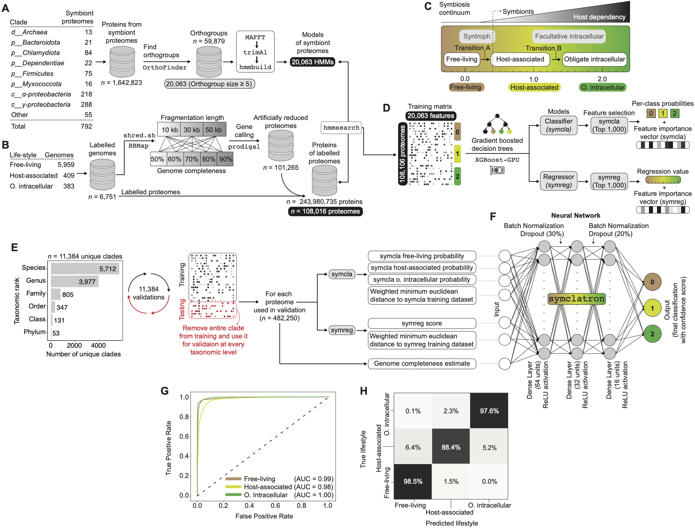

# symclatron: symbiont classifier



`symclatron` classifies microbial genomes into three lifestyle categories:

- `Free-living`
- `Symbiont;Host-associated`
- `Symbiont;Obligate-intracellular`

It accepts protein FASTA directly, or nucleotide FASTA with automatic conversion to proteins before classification.

Version **0.10.12** adds protein evidence reports and fixes input handling and database setup. See the [changelog](CHANGELOG.md).

## What symclatron implements

For each genome, `symclatron` currently performs the following workflow:

1. Validates the input FASTA file(s) and checks that genome identifiers derived from filenames are unique.
2. Detects whether each input file contains proteins, nucleotide genes/CDS, or nucleotide contigs/assemblies.
3. Converts nucleotide input to proteins.
   - Gene/CDS FASTA (`.ffn`, `.fnn`) is translated in frame.
   - Contig/assembly FASTA (`.fa`, `.fas`, `.fasta`, `.fna`) is gene-called and translated with `pyrodigal`.
4. Runs HMM searches against the `symclatron` feature set and the `UNI56` marker set.
5. Builds feature matrices for the `symcla`, `symreg`, and `hostcla` XGBoost submodels.
6. Computes additional distance-based features relative to the training data.
7. Applies the final neural-network model to produce the reported class and confidence score.
8. Optionally relabels low-confidence predictions as `Unknown` when `--confidence-threshold` is provided.
9. Writes final tables, summaries, logs, and optional intermediate files.

The final reported class is produced by the neural-network stage. The `hostcla` model is still run and its intermediate bitscore table is retained in the output directory.

## Installation

The project metadata currently targets Python `3.12` on Linux and Apple Silicon macOS (`osx-arm64`, including M1-M5). The recommended install path is `pixi`; `mamba`/`conda` also works.

### Option 1: `pixi` (recommended)

Install `pixi`:

```sh
curl -fsSL https://pixi.sh/install.sh | sh
```

Then install `symclatron` and download the data bundle:

```sh
pixi global install --pinning-strategy no-pin -c conda-forge -c bioconda -c https://repo.prefix.dev/astrogenomics symclatron
symclatron setup
```

If `symclatron` was already installed with default pinning, reset it once so future upgrades
do not get stuck on an older `0.x` minor line:

```sh
pixi global add --environment symclatron --pinning-strategy no-pin symclatron
pixi global update symclatron
```

Run the bundled self-test:

```sh
symclatron test
```

### Option 2: `mamba` or `conda`

```sh
mamba create -n symclatron -c conda-forge -c bioconda -c https://repo.prefix.dev/astrogenomics symclatron
mamba run -n symclatron symclatron setup
mamba run -n symclatron symclatron test
```

`pixi global install` and the conda-based workflow install both CLI names:

- `symclatron`
- `symcla`

For example, `symcla classify ...` is equivalent to `symclatron classify ...`.

## First-time setup

Before classification, download the packaged database and model bundle once:

```sh
symclatron setup
```

Useful setup options:

- `--force`, `-f`: download a replacement bundle, preserving existing data if setup fails
- `--data-url`: override the default GitHub Release URL
- `--data-sha256`: verify the downloaded archive against a SHA256 digest
- `--quiet`, `-q`: suppress routine progress messages

By default, `setup` downloads the bundle from the GitHub Release tag `db-latest`.

## Accepted inputs

`--genome-dir` can point either to a directory containing one genome per file, or to a single FASTA file.

### Supported FASTA input types

| Input type | Typical suffixes | What symclatron does |
| --- | --- | --- |
| Protein FASTA | `.faa`, `.faa.gz`, `.aa`, `.aa.fasta`, `.pep`, `.pep.fasta`, `.protein.faa` | Uses proteins directly |
| Nucleotide genes/CDS FASTA | `.ffn`, `.ffn.gz`, `.fnn`, `.fnn.gz` | Translates sequences in frame |
| Nucleotide contig/assembly FASTA | `.fa`, `.fa.gz`, `.fas`, `.fas.gz`, `.fasta`, `.fasta.gz`, `.fna`, `.fna.gz` | Predicts genes and proteins with `pyrodigal` |

Notes:

- Gzipped FASTA files are supported.
- If file extensions are ambiguous, use `--input-kind proteins`, `--input-kind genes`, or `--input-kind contigs`.
- Use `--input-ext` to restrict which files are picked up from a directory.
- Genome identifiers in the output come from input filenames, so filenames should be unique within a run.

## Quick start

### Classify protein FASTA

```sh
symclatron classify --genome-dir /path/to/proteins --output-dir results
```

### Classify contig FASTA and predict proteins automatically

```sh
symclatron classify --genome-dir /path/to/contigs --output-dir results
```

### Force contig mode and only include `.fna` files

```sh
symclatron classify \
  --genome-dir /path/to/inputs \
  --input-kind contigs \
  --input-ext .fna \
  --output-dir results
```

### Override the default confidence threshold

```sh
symclatron classify \
  --genome-dir /path/to/genomes \
  --confidence-threshold 0.80 \
  --output-dir results
```

## CLI reference

### `symclatron classify`

```sh
symclatron classify [OPTIONS]
```

Options:

- `--genome-dir`, `-i`: input directory or single FASTA file
- `--input-kind`: `auto`, `proteins`, `genes`, or `contigs`
- `--input-ext`: limit directory scanning to specific extensions; repeat the flag or pass comma-separated values
- `--output-dir`, `-o`: results directory; default is `output_Symclatron_<DATETIME>`
- `--keep-tmp`: keep intermediate files instead of removing `tmp/`
- `--threads`, `-t`: number of HMMER threads, from `1` to `32`
- `--confidence-threshold`: threshold for conservative interpretation; defaults to `0.725` and can be overridden
- `--quiet`, `-q`: suppress routine console progress output
- `--verbose`: increase log detail

Examples:

```sh
symclatron classify --genome-dir genomes --output-dir results
symclatron classify --genome-dir genomes --threads 8 --keep-tmp --output-dir results
symclatron classify --genome-dir genomes --quiet --output-dir results
symclatron classify --genome-dir genomes --verbose --output-dir results
```

### `symclatron test`

```sh
symclatron test [OPTIONS]
```

This runs the bundled example data installed by `symclatron setup`.

Options:

- `--keep-tmp`: keep intermediate files for the test run
- `--mode`: `proteins`, `contigs`, or `both` (default)
- `--output-dir`, `-o`: test output root; default is `output_test_Symclatron_<DATETIME>`
- `--confidence-threshold`: threshold for conservative interpretation; defaults to `0.725` and can be overridden

When `--mode both` is used, results are written under:

- `<output-dir>/faa`
- `<output-dir>/fna`

### `symclatron setup`

```sh
symclatron setup [OPTIONS]
```

Options:

- `--force`, `-f`: redownload the data bundle even if it already exists
- `--quiet`, `-q`: suppress routine setup messages
- `--data-url`: override the default bundle URL
- `--data-sha256`: expected SHA256 digest for the bundle

### Help and version

```sh
symclatron --help
symclatron classify --help
symclatron setup --help
symclatron test --help
symclatron --version
```

## Output files

The main output directory is intentionally kept simple for end users. At the top level you should expect:

- `symclatron_results.tsv`
- `classification_summary.txt`
- `logs/`
- `extra_results/`

### Final result table: `symclatron_results.tsv`

Columns:

- `taxon_oid`: genome identifier derived from the input filename
- `completeness_UNI56`: estimated completeness based on the `UNI56` marker set
- `classification`: final predicted lifestyle class
- `confidence`: confidence score for the reported class
- `passes_confidence_threshold`: boolean column showing whether `confidence >= applied_threshold`
- `classification_thresholded`: conservative label using the applied threshold; predictions below threshold are reported as `Unknown`

Exact class labels written by the current implementation are:

- `Free-living`
- `Symbiont;Host-associated`
- `Symbiont;Obligate-intracellular`

### Summary and logs

- `classification_summary.txt`: counts and summary statistics for the run
- `logs/symclatron.log`: run log
- `logs/resource_usage_*.log`: resource-monitoring log

### Auxiliary TSV outputs in `extra_results/`

These reports persist without `--keep-tmp` and use the original genome identifiers in `taxon_oid`.

| File | Contents |
| --- | --- |
| `bitscore_symcla.tsv`, `bitscore_symreg.tsv`, `bitscore_hostcla.tsv` | Per-genome HMM feature scores used by each submodel |
| `shap_symreg.tsv`, `shap_melt_symreg.tsv` | Contributions to the `symreg` score, in wide and long formats |
| `feature_contribution_symreg.tsv` | Mean absolute SHAP value per feature across genomes |
| `feature_hits.tsv` | Proteins corresponding to classifier features, including highest-score indicators |
| `uni56_presence.tsv` | Each marker's presence (1/0), `total_UNI56`, `completeness_UNI56`, and semicolon-separated `missing_markers` |
| `uni56_copy_number.tsv` | Distinct protein records per UNI56 marker, including zeros |
| `uni56_hits.tsv` | Proteins corresponding to detected UNI56 markers |

Both hit reports contain `model`, `protein_name`, full-sequence `evalue` and `score`, and `protein_record_index`. Protein names retain the original FASTA identifier before the first whitespace. Translated CDS retain their CDS IDs; predicted proteins use the contig ID with a gene-number suffix. The 1-based record index distinguishes duplicate identifiers within each genome's protein FASTA; for nucleotide inputs, it refers to the translated or predicted records. Repeated domains within one protein count once per marker.

To trace a feature to proteins, join on `taxon_oid` and its identifier (`model` in the hit report, `feature` in the long SHAP table, or the column name in wide tables). In `feature_hits.tsv`, `is_best_hit=True` marks all proteins tied for the highest recorded score used in the feature matrix. Scores retain the matrix's one-decimal precision. Classifier searches use a permissive E-value threshold of 1000; these hits alone do not establish protein function.

SHAP explains genome-level features contributing to the **`symreg` score**, not individual proteins or the final neural-network classification. A feature's absence can contribute to this score even when it has no protein-hit rows.

### Temporary files

If `--keep-tmp` is used, the `tmp/` directory is kept. It contains renamed FASTA files, merged FASTA files, HMMER tables, model-specific feature tables, and additional intermediate prediction files.

## Interpreting the results

- The `classification` column always reports the highest-probability final class.
- The default conservative threshold is `0.725` for every run.
- Use `--confidence-threshold <value>` only when you want to override that default.
- Lower-confidence calls are preserved in `classification` but are relabeled as `Unknown` in `classification_thresholded`.
- `completeness_UNI56` is provided to help judge how complete the genome appears relative to the marker set used by the workflow.

### Investigating UNI56 completeness

UNI56 provides a simplified completeness estimate designed for rapid assessment within the symclatron workflow. The `completeness_UNI56` value is also a required input to the final lifestyle classifier. It is not intended to replace completeness estimates from more sophisticated tools such as CheckM or CheckM2, which should be used for dedicated genome quality assessment.

`completeness_UNI56` is calculated as `100 × detected UNI56 markers / 56`, rounded to two decimal places. Multiple protein copies of a marker count only once. UNI56 searches use the gathering thresholds stored in the bundled HMM profiles.

UNI56 and other completeness estimates are not directly interchangeable. Differences in estimation methods, marker sets, gene calls, and detection thresholds can produce different values for the same genome. When investigating a discrepancy, first confirm that the estimates refer to the same input assembly and consider how each method detects and interprets the available sequence evidence.

To inspect the evidence behind the UNI56 estimate, check `extra_results/uni56_presence.tsv` for detected and missing markers, `extra_results/uni56_copy_number.tsv` for the number of detected copies of each marker, and `extra_results/uni56_hits.tsv` for the corresponding proteins, scores, and E-values. A missing marker means it was not detected under the search settings; it does not establish that the gene is biologically absent. Copy counts do not increase the completeness estimate: a marker with multiple detected copies still contributes only once.

UNI56 markers are generally expected to occur in a single copy, but their copy number can vary among clades. Multiple detected copies may indicate contamination or mixed strains, but can also reflect genuine gene duplication, assembly artifacts, or fragmented gene predictions. The reported counts represent distinct detected protein records, not independently verified gene copies or a contamination percentage. Interpret them in the context of the genome's taxonomy and independent quality assessments; the [CheckM documentation](https://github.com/Ecogenomics/CheckM/wiki/Genome-Quality-Commands#qa) describes related considerations when interpreting duplicated markers.

Users are responsible for appropriate quality assurance and quality control (QA/QC) of their genomes and metagenome-assembled genomes (MAGs), including independent completeness and contamination assessment before classification. Symclatron is not a genome QA/QC tool: it expects good-quality, appropriately curated input genomes to make reliable lifestyle predictions.

For results from older versions, rerun with `--keep-tmp` to inspect `tmp/uni56_presence.tsv` and `tmp/uni56_hits_with_protein_names.tsv`. These older intermediate tables use internal genome and protein identifiers; the mappings are in `tmp/genomes_dict.json` and `tmp/renamed_genomes/genome_*_dict.json`.

## Citation

If you use `symclatron` in your research, please cite:

**A genomic catalog of Earth’s bacterial and archaeal symbionts.**

Juan C. Villada, Yumary M. Vasquez, Gitta Szabó, Ewan Whittaker-Walker, Miguel F. Romero, Sarina Qin, Neha Varghese, Emiley A. Eloe-Fadrosh, Nikos C. Kyrpides, SymGs data consortium, Axel Visel, Tanja Woyke, Frederik Schulz.

*Nature Biotechnology* (2026). Published 31 August 2026. DOI: [10.1038/s41587-026-03213-1](https://doi.org/10.1038/s41587-026-03213-1).

## Support

- Repository: <https://github.com/NeLLi-team/symclatron>
- Issues: <https://github.com/NeLLi-team/symclatron/issues>
- Author: Juan C. Villada <jvillada@lbl.gov>
